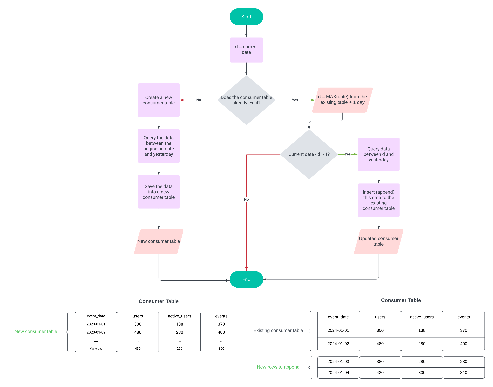

# optimised_query

=================

I will collect marketing analytics queries here, that are crafted with optimisation in mind.

[every_day_schedule](#every_day_schedule)

# every_day_schedule

====================

Running once per day in a BigQuery environment, this query transforms GA4 raw data into a table ready for data visualization. Querying GA4 row data daily can be resource-intensive if you simply rewrite it each time. Since GA4 data never alters existing rows, appending new data becomes possible, allowing for optimization of costs and resources. Even though this example made with GA4 data it can be applied to any data, which are not altered by ingestion.

## Optimisation flow

====================

Let's have a look at the schema.

--declare a variable d and set it to the current date
--check if the table already exists
--if yes
--set the variable d to the next day after the maximum date in the existing table
--check if the difference between the current date and the maximum date in the table > 0
--if yes
--insert the data between the variable d and yesterday
--if no
--do nothing
--if the table doesn't exists
--create the table with the date between your start date (e.g. '20230101') and yesetrday
